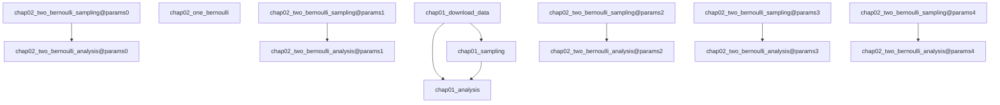

## summary

```mermaid
flowchart TD
	node1["chap01_analysis"]
	node2["chap01_download_data"]
	node3["chap01_sampling"]
	node2-->node1
	node2-->node3
	node3-->node1
	node4["chap02_one_bernoulli"]
	node5["chap02_two_bernoulli_analysis@params0"]
	node6["chap02_two_bernoulli_sampling@params0"]
	node6-->node5
	node7["chap02_two_bernoulli_analysis@params1"]
	node8["chap02_two_bernoulli_sampling@params1"]
	node8-->node7
	node9["chap02_two_bernoulli_analysis@params2"]
	node10["chap02_two_bernoulli_sampling@params2"]
	node10-->node9
	node11["chap02_two_bernoulli_analysis@params3"]
	node12["chap02_two_bernoulli_sampling@params3"]
	node12-->node11
	node13["chap02_two_bernoulli_analysis@params4"]
	node14["chap02_two_bernoulli_sampling@params4"]
	node14-->node13
```
## detail

```mermaid
flowchart TD
	node1["data/interim/trace_and_model.pickle"]
	node2["data/processed/chapter01/trace_summary.csv"]
	node3["data/raw/dataset.csv"]
	node4["reports/figures/chapter01"]
	node1-->node2
	node1-->node4
	node3-->node1
	node3-->node2
	node3-->node4
	node5["data/processed/chapter02/two/params0"]
	node6["models/chapter02/params0/two_bernoulli_model.pickle"]
	node7["models/chapter02/params0/two_bernoulli_theta.npz"]
	node8["reports/figures/chapter02/two/params0/histogram.png"]
	node9["reports/figures/chapter02/two/params0/trace.png"]
	node6-->node5
	node6-->node8
	node6-->node9
	node7-->node5
	node7-->node8
	node7-->node9
	node10["data/processed/chapter02/two/params1"]
	node11["models/chapter02/params1/two_bernoulli_model.pickle"]
	node12["models/chapter02/params1/two_bernoulli_theta.npz"]
	node13["reports/figures/chapter02/two/params1/histogram.png"]
	node14["reports/figures/chapter02/two/params1/trace.png"]
	node11-->node10
	node11-->node13
	node11-->node14
	node12-->node10
	node12-->node13
	node12-->node14
	node15["data/processed/chapter02/two/params2"]
	node16["models/chapter02/params2/two_bernoulli_model.pickle"]
	node17["models/chapter02/params2/two_bernoulli_theta.npz"]
	node18["reports/figures/chapter02/two/params2/histogram.png"]
	node19["reports/figures/chapter02/two/params2/trace.png"]
	node16-->node15
	node16-->node18
	node16-->node19
	node17-->node15
	node17-->node18
	node17-->node19
	node20["data/processed/chapter02/two/params3"]
	node21["models/chapter02/params3/two_bernoulli_model.pickle"]
	node22["models/chapter02/params3/two_bernoulli_theta.npz"]
	node23["reports/figures/chapter02/two/params3/histogram.png"]
	node24["reports/figures/chapter02/two/params3/trace.png"]
	node21-->node20
	node21-->node23
	node21-->node24
	node22-->node20
	node22-->node23
	node22-->node24
	node25["data/processed/chapter02/two/params4"]
	node26["models/chapter02/params4/two_bernoulli_model.pickle"]
	node27["models/chapter02/params4/two_bernoulli_theta.npz"]
	node28["reports/figures/chapter02/two/params4/histogram.png"]
	node29["reports/figures/chapter02/two/params4/trace.png"]
	node26-->node25
	node26-->node28
	node26-->node29
	node27-->node25
	node27-->node28
	node27-->node29
	node30["reports/figures/chapter02/one/bernoulli.png"]
```
