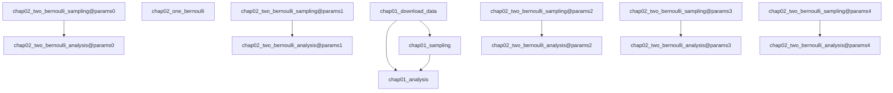

```mermaid
flowchart TD
	node1["chap01_analysis"]
	node2["chap01_download_data"]
	node3["chap01_sampling"]
	node2-->node1
	node2-->node3
	node3-->node1
	node4["chap02_one_bernoulli"]
	node5["chap02_two_bernoulli_analysis@params0"]
	node6["chap02_two_bernoulli_sampling@params0"]
	node6-->node5
	node7["chap02_two_bernoulli_analysis@params1"]
	node8["chap02_two_bernoulli_sampling@params1"]
	node8-->node7
	node9["chap02_two_bernoulli_analysis@params2"]
	node10["chap02_two_bernoulli_sampling@params2"]
	node10-->node9
	node11["chap02_two_bernoulli_analysis@params3"]
	node12["chap02_two_bernoulli_sampling@params3"]
	node12-->node11
	node13["chap02_two_bernoulli_analysis@params4"]
	node14["chap02_two_bernoulli_sampling@params4"]
	node14-->node13
```
